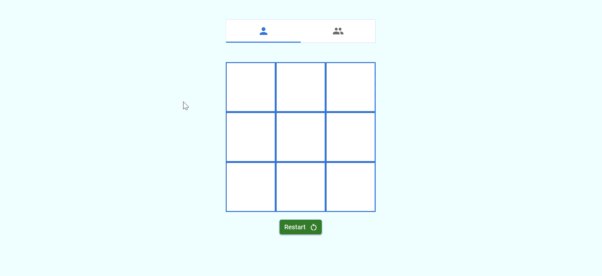
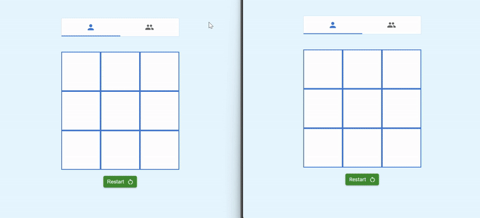

# Tic Tac Toe

A modern Tic Tac Toe game built with React and Material UI, featuring both single-player and multiplayer modes using Socket.IO.

## Features

- Play against the computer (single-player)
- Play with friends in real-time (multiplayer)
- Room-based multiplayer with easy join
- Responsive UI with Material UI components
- Game restart and draw detection

## Showcase

### Single Player


### Multi Player


## Getting Started

### Prerequisites

- Node.js (v14 or higher)
- npm

### Installation

1. Clone the repository:
   ```sh
   git clone https://github.com/hrushikesh1999/tic-tac-toe
   cd tic-tac-toe
   ```

2. Install dependencies:
   ```sh
   npm install
   ```

3. Set up environment variables:
   - Edit `.env` and set your backend URL:
     ```
     REACT_APP_BACKEND_URL='http://localhost:3001/'
     ```

4. Start the development server:
   ```sh
   npm start
   ```

## Usage

- **Single Player:** Select the single player tab and play against the computer.
- **Multiplayer:** Select the multiplayer tab, enter a room ID, and invite a friend to join the same room.

## Project Structure

```
src/
  components/
  config/
  pages/
    home/
      components/
      functions/
  types/
public/
```

## Technologies Used

- React
- Material UI
- Socket.IO
- TypeScript

## License

This project is licensed under the MIT License.

---
